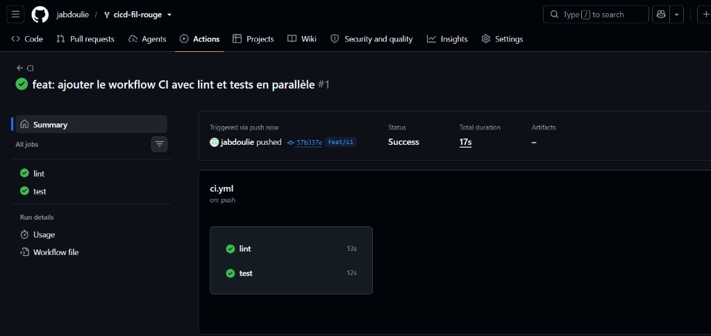
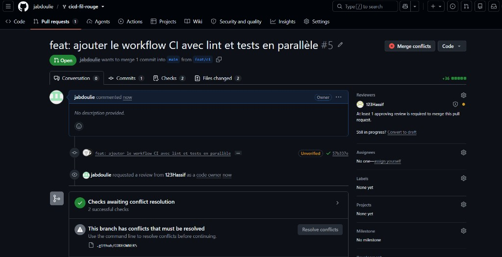
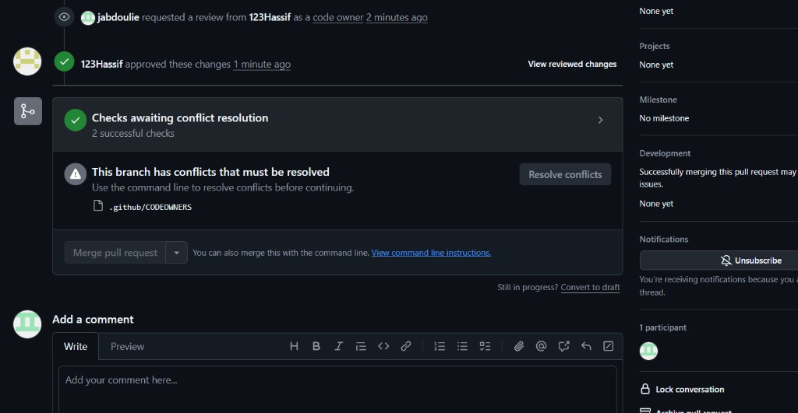
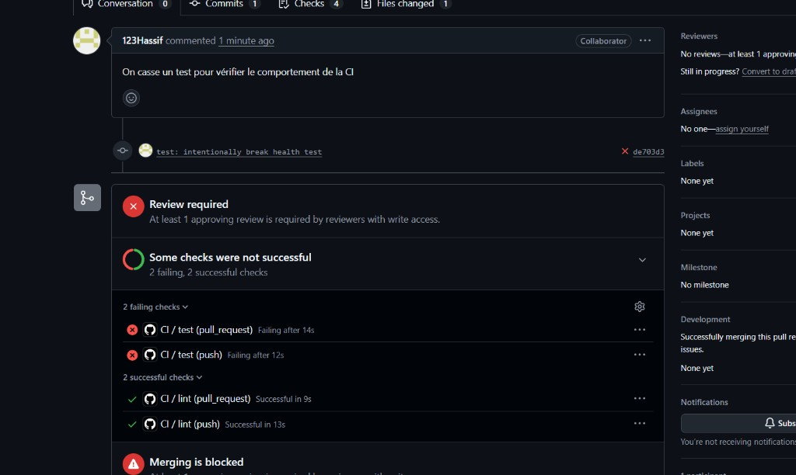
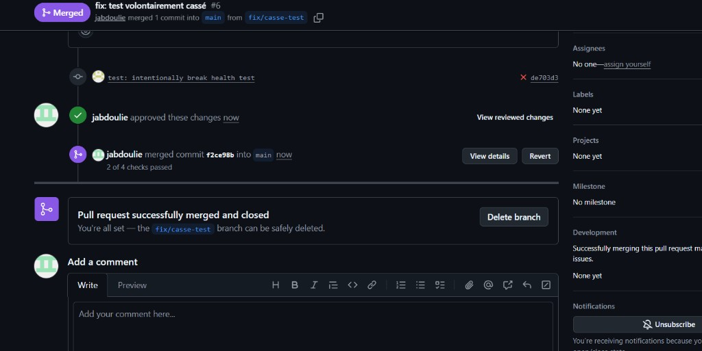
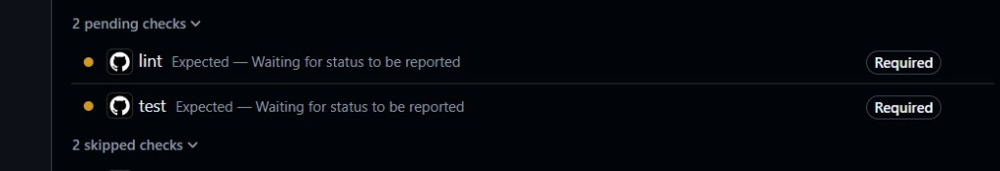
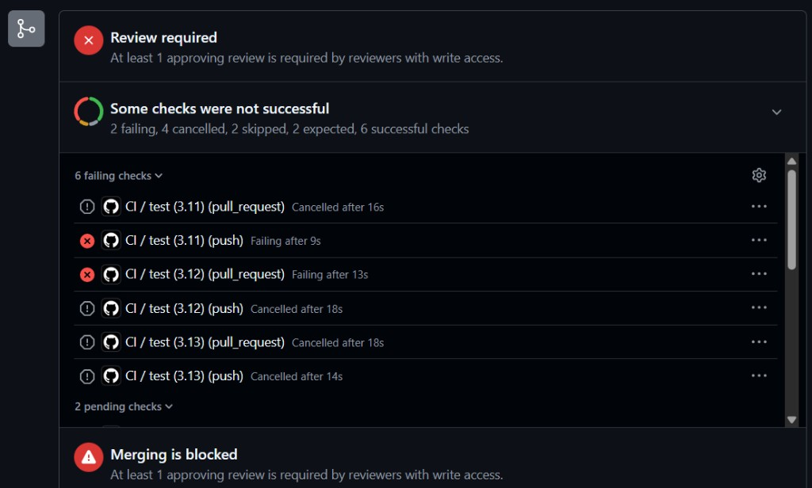
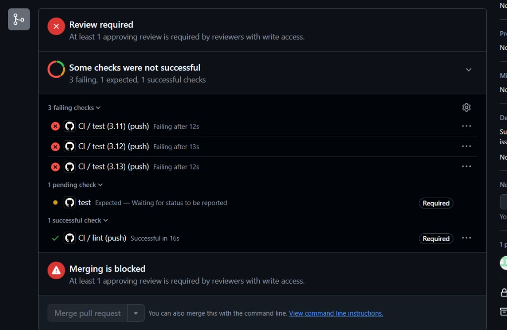
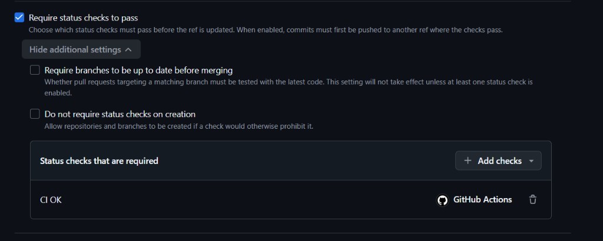
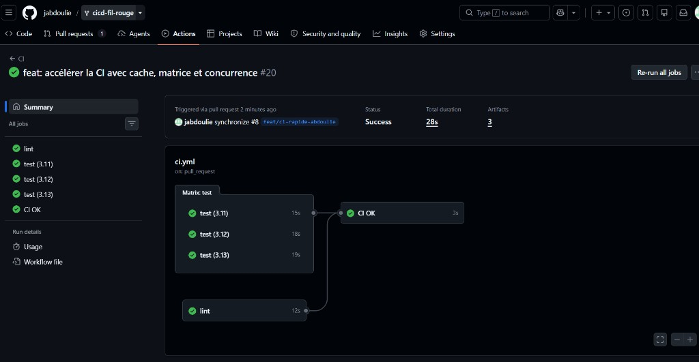

# TaskFlow — dépôt fil rouge CI/CD

TaskFlow est une petite API de gestion de tâches écrite en Python avec FastAPI.
C'est le projet fil rouge du module CI/CD (Mastère DevOps M1, Sup de Vinci) :
pendant trois jours, vous allez construire autour d'elle un pipeline complet
qui teste, construit, sécurise et livre l'application.

## Lancer l'API en local

Prérequis : Python 3.10 ou plus récent.

```bash
python3 -m venv .venv
source .venv/bin/activate          # Windows : .venv\Scripts\activate
pip install -r requirements-dev.txt
uvicorn app.main:app --reload
```

L'API répond sur http://localhost:8000 et sa documentation interactive est sur
http://localhost:8000/docs.

## Vérifier le code

```bash
pytest           # tests automatiques
ruff check .     # lint
ruff format .    # mise en forme
```

## Lancer avec Docker

```bash
docker build -t taskflow .
docker run --rm -p 8000:8000 taskflow
```

## Endpoints

| Méthode | Chemin | Rôle |
| --- | --- | --- |
| GET | `/health` | État de l'API et version |
| GET | `/tasks` | Liste des tâches |
| GET | `/tasks/search?q=...` | Recherche dans les titres |
| POST | `/tasks` | Crée une tâche (`{"title": "..."}`) |
| GET | `/tasks/{id}` | Détail d'une tâche |
| PATCH | `/tasks/{id}/done` | Marque une tâche comme faite |
| DELETE | `/tasks/{id}` | Supprime une tâche (en-tête `X-API-Token` requis) |

## Configuration

| Variable | Rôle | Défaut |
| --- | --- | --- |
| `APP_VERSION` | Version affichée par `/health` | `0.1.0` |
| `DB_PATH` | Fichier SQLite | `taskflow.db` |
| `API_TOKEN` | Jeton exigé pour supprimer une tâche | vide (suppression désactivée) |
| `NOTIFY_WEBHOOK_URL` | Webhook appelé à chaque création de tâche | vide (désactivé) |

## Équipe

- Hassif 
- Abdoulie

## Gouvernance du dépôt

Nécissite une approbation
Pas de force push 
Pas de suppresion

## Rendu

### CI lint et tests en parallèle

Les jobs `lint` et `test` partent ensemble et passent au vert.



### Conflit sur `.github/CODEOWNERS`

La pull request du workflow CI ne peut pas être mergée tant que le conflit sur `.github/CODEOWNERS` n'est pas résolu.



Hassif a approuvé, mais le merge reste bloqué par ce conflit.



### Test cassé volontairement

Un test health est cassé pour vérifier que la CI devient rouge. Le lint reste vert, le job `test` échoue.



La pull request est ensuite mergée.



### Checks obligatoires qui ne correspondent plus

Après la matrice, GitHub attend encore des checks nommés `lint` et `test`. Ces noms ne sont plus publiés tels quels, donc ils restent en attente.



Les exécutions suivantes s'annulent entre elles, et la revue d'une personne avec droit d'écriture reste exigée.



La matrice 3.11, 3.12 et 3.13 échoue sur le même test health, et le check obligatoire `test` n'arrive jamais.



### Un seul check obligatoire : CI OK

La ruleset n'exige plus que le check `CI OK`.



`lint`, les trois versions de Python et `CI OK` passent.


